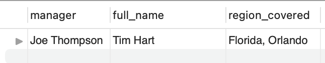
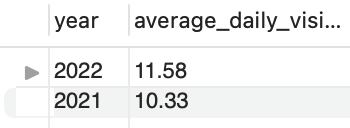
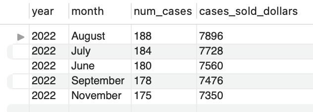
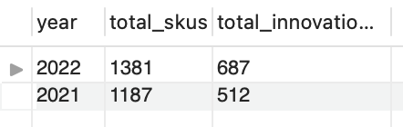

## Rep Beverage Year End Performance review Project SQL—>Tableau

##### By: Steven Nguyen

## Introduction

##### In this project I will use MySQL to explore and analyze data and then visualize the data in Tableau to provide insights to the stakeholders.

## Objective
###### (*Please note that the names in the project are fictitious and are used only for the purpose of this project & the dataset is a mock dataset*)
##### As Tim Hart, the sales rep for a beverage company covering Orlando, Florida, I will need to present data-driven insights to senior leadership during my upcoming end-of-year performance review. The purpose is to showcase my overall performance compared to the previous year and demonstrate whether I have increased market share in your area. This will help senior leadership assess my overall performance, eligibility for a full merit increase in pay and my readiness for a promotion. To accomplish this, I will need to answer questions like:
	
 	1. What were the key metrics in which I outperformed last year?
	2. What was the trend in sales performance over the months? Which month was the best for sales?
	3. Is there any correlation between key metrics and cases sold?
	4. How did my account visits impact sales performance?
 	5. How are facings gained, point of sale (POS) placements, and coolers placed related to the number of cases sold?

## Stakeholders

    1. John David - Director of Sales
    2. Joe Thompson - Regional Manager

#### I will examine the table to look for anything to fix/clean before I do my analysis
```
SELECT * FROM rep;
```
#### Changing column name cases_sold to cases_sold_dollars as this will avoid confusion there is another column named num_of_cases.
```
ALTER TABLE rep
RENAME COLUMN cases_sold to cases_sold_dollars;
```

#### Checking if change was made
```
SELECT * FROM rep;
```
<!-- -->

#### Finding the name of the sales rep, region covered and manager
```
SELECT manager,CONCAT(first_name,' ',last_name) as full_name,
       CONCAT(state,', ',city) as region_covered
FROM rep
LIMIT 1;
```
<!-- -->

## STEPS
#### 1. Finding total amount of accounts visited in 2021 vs 2022
```
SELECT year, SUM(account_visits) as total_visits
FROM rep
WHERE year IN('2021','2022')
GROUP BY 1;
```
<!-- -->
#### 2. Finding the total of cases sold and # of cases sold in 2021 and 2022
```
SELECT year, SUM(cases_sold_dollars) as total_cases_$,
       SUM(num_cases) total_cases
FROM rep
WHERE year IN('2021','2022')
GROUP BY 1;
```
<!-- -->
#### 3. Finding the average of cases sold and # of cases sold in 2021 and 2022
```
SELECT year, ROUND(AVG(cases_sold_dollars),2) as total_cases_$,
       ROUND(AVG(num_cases),2) total_cases
FROM rep
WHERE year IN('2021','2022')
GROUP BY 1;
```
<!-- -->

#### 4. Finding the average daily visits in 2021 vs 2022
```
SELECT year,ROUND(AVG(avg_daily_visits),2) as average_daily_visits
FROM rep
WHERE year IN('2021','2022')
GROUP BY 1;
```
<!-- -->
#### 5. Finding the top month with the most cases sold
```
SELECT year,month,
       num_cases,cases_sold_dollars
FROM rep
ORDER BY 3 DESC
LIMIT 1;
```
<!-- -->
#### 6. Finding the top 5 month with the most cases sold
```
SELECT year,month,
       num_cases,cases_sold_dollars
FROM rep
ORDER BY 3 DESC
LIMIT 5;
```
<!-- -->
#### 7. Finding the bottom 5 months with the most cases sold in the most recent year
```
SELECT year,month,num_cases,
      cases_sold_dollars
FROM rep
WHERE year='2022'
ORDER BY 3 ASC
LIMIT 5;
```
<!-- -->
#### 8. Finding the average monthly visits 2021 vs 2022
```
SELECT year, ROUND(AVG(Account_Visits),2) as average_monthly
FROM rep
WHERE year IN('2022','2021')
GROUP BY 1;
```
<!-- -->
#### 9. Comparing core skus and innovations sold between 2021 vs 2022
```
SELECT year, SUM(core_skus) as total_skus,
       SUM(innovations) as total_innovations
FROM rep
WHERE year IN('2022','2021')
GROUP BY 1;
```
<!-- -->
#### 10. Seeing if placing POS and Coolers has a correlation in the # of cases sold for the year 2022
```
SELECT year, month,pos,coolers,num_cases
FROM rep
WHERE year='2022'
ORDER BY 5 DESC;
```
<!-- -->
#### 11. Finding the average weekly visits 2021 vs 2022
```
SELECT year, ROUND(SUM(Account_Visits)/52,2) as average_weekly
FROM rep
WHERE year IN('2022','2021')
GROUP BY 1
```
<!-- -->
#### 12. Finding the total weekly visits by month in 2022 (There is excatly 4.34 weeks in a month)
```
SELECT year, month,
       ROUND(SUM(Account_Visits)/4.34,2) as average_weekly
FROM rep
WHERE year IN('2022')
GROUP BY 1,2
ORDER BY 3 DESC;
```
<!-- -->
#### 13. Seeing if there is a correlation between # of facings gained in cold vault and # of cases sold.
```
SELECT month,facing_gained,num_cases
FROM rep
WHERE year='2022'
ORDER BY 3 DESC;
```
<!-- -->
#### 14. Seeing if there is a correlation between account visits and # of cases sold
```
SELECT year,SUM(account_visits) as total_accounts,
       SUM(cases_sold_dollars) as total_cases_$,
       SUM(num_cases) total_cases
FROM rep
WHERE year IN('2021','2022')
GROUP BY 1;
```
<!-- -->

###### *Now the data is ready to be visualized in Tableau*

## [Link to Tableau Dashboard](https://public.tableau.com/views/Sales_Rep_Dashboard/Dashboard1?:language=en-US&:display_count=n&:origin=viz_share_link)

<!-- -->

## Final insights
* There is a direct correlation between account visits and cases sold.
* I have performed better in every metric compared to last year.
* There is a direct correlation between facings gained, POS, coolers placed, and the number of cases sold.
* August was my best month of sales.
* June, July, and August are the busiest months, while the winter/holiday months are the slowest.
* December was my worst-performing month because I took a vacation.
* There was a 12.1% year-over-year (YOY) increase in account visits, which correlated to a 13.25% increase in cases sold.
* According to the forecast model in Tableau, I am projected to hit $8,000 in monthly sales comapred to $7500.
* I sold $10,000 more than last year and increased my daily visits by more than one stop a day!
* I sold a total of $86,860 compared to $76,690 the previous year and visited 3,011 accounts compared to 2,686 last year.
