## Rep Beverage Year End Performance review Project SQL—>Tableau

##### By: Steven Nguyen

## Introduction

##### In this project I will use MySQL to explore and analyze data and then visualize the data in Tableau to provide insights to the stakeholders.

## Objective

##### I am a sales rep who works for a beverage company covering Orlando, Florida. It is the end of the year performance review. I am tasked with presenting to senior leadership about my overall performance compared to the pervious year. They want to see if I increased market share in my area. They will need data driven insights from me to evaluate my performance and to see if I deserve a full merit increase in pay and if I’m ready for a promotion. To deliver data driven insights to my stakeholder I will answer questions like:
	1.Did KPIs increase YOY like account visits, cases sold, facings gained?
	2.How can I improve my performance as a sales rep for the upcoming year?
	3. Is There any correlation between key metrics and cases sold?
	4. Is there any trends?
	

## Stakeholders

    [] Joe Thompson - Regional Manager
    [] John David - Director of Sales

#### I will examine the table to look for anything to fix/clean before I do my analysis
```
SELECT * FROM rep;
```
#### Changing column name cases_sold to cases_sold_dollars as this will avoid confusion there is another column named num_of_cases.
```
ALTER TABLE rep
RENAME COLUMN cases_sold to cases_sold_dollars;
```

#### Checking if change was made
```
SELECT * FROM rep;
```
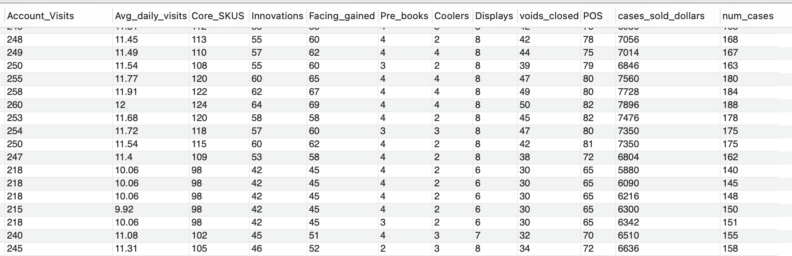<!-- -->

#### Finding the name of the sales rep, region covered and manager
```
SELECT manager,CONCAT(first_name,' ',last_name) as full_name,
       CONCAT(state,', ',city) as region_covered
FROM rep
LIMIT 1;
```
<!-- -->

## STEPS
#### 1. Finding total amount of accounts visited in 2021 vs 2022
```
SELECT year, SUM(account_visits) as total_visits
FROM rep
WHERE year IN('2021','2022')
GROUP BY 1;
```
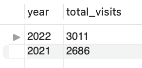<!-- -->
#### 2. Finding the total of cases sold and # of cases sold in 2021 and 2022
```
SELECT year, SUM(cases_sold_dollars) as total_cases_$,
       SUM(num_cases) total_cases
FROM rep
WHERE year IN('2021','2022')
GROUP BY 1;
```
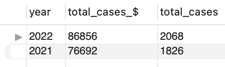<!-- -->
#### 3. Finding the average of cases sold and # of cases sold in 2021 and 2022
```
SELECT year, ROUND(AVG(cases_sold_dollars),2) as total_cases_$,
       ROUND(AVG(num_cases),2) total_cases
FROM rep
WHERE year IN('2021','2022')
GROUP BY 1;
```
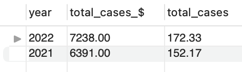<!-- -->

#### 4. Finding the average daily visits in 2021 vs 2022
```
SELECT year,ROUND(AVG(avg_daily_visits),2) as average_daily_visits
FROM rep
WHERE year IN('2021','2022')
GROUP BY 1;
```
<!-- -->
#### 5. Finding the top month with the most cases sold
```
SELECT year,month,
       num_cases,cases_sold_dollars
FROM rep
ORDER BY 3 DESC
LIMIT 1;
```
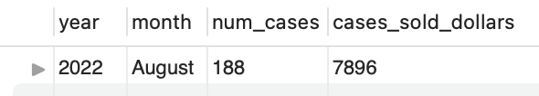<!-- -->
#### 6. Finding the top 5 month with the most cases sold
```
SELECT year,month,
       num_cases,cases_sold_dollars
FROM rep
ORDER BY 3 DESC
LIMIT 5;
```
<!-- -->
#### 7. Finding the bottom 5 months with the most cases sold in the most recent year
```
SELECT year,month,num_cases,
      cases_sold_dollars
FROM rep
WHERE year='2022'
ORDER BY 3 ASC
LIMIT 5;
```
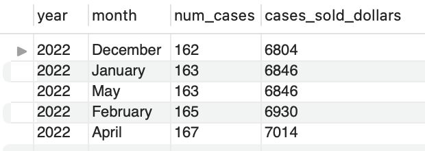<!-- -->
#### 8. Finding the average monthly visits 2021 vs 2022
```
SELECT year, ROUND(AVG(Account_Visits),2) as average_monthly
FROM rep
WHERE year IN('2022','2021')
GROUP BY 1;
```
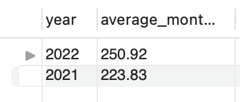<!-- -->
#### 9. Comparing core skus and innovations sold between 2021 vs 2022
```
SELECT year, SUM(core_skus) as total_skus,
       SUM(innovations) as total_innovations
FROM rep
WHERE year IN('2022','2021')
GROUP BY 1;
```
<!-- -->
#### 10. Seeing if placing POS and Coolers has a correlation in the # of cases sold for the year 2022
```
SELECT year, month,pos,coolers,num_cases
FROM rep
WHERE year='2022'
ORDER BY 5 DESC;
```
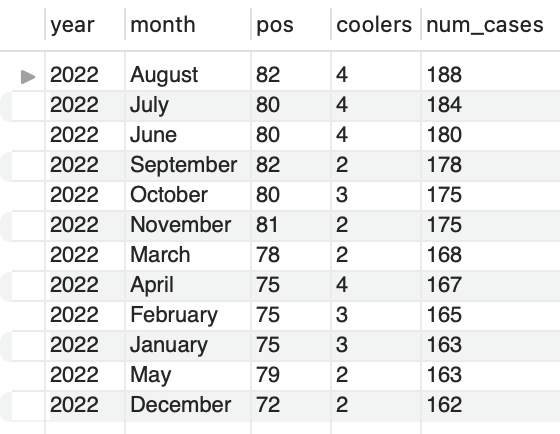<!-- -->
#### 11. Finding the average weekly visits 2021 vs 2022
```
SELECT year, ROUND(SUM(Account_Visits)/52,2) as average_weekly
FROM rep
WHERE year IN('2022','2021')
GROUP BY 1
```
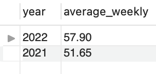<!-- -->
#### 12. Finding the total weekly visits by month in 2022 (There is excatly 4.34 weeks in a month)
```
SELECT year, month,
       ROUND(SUM(Account_Visits)/4.34,2) as average_weekly
FROM rep
WHERE year IN('2022')
GROUP BY 1,2
ORDER BY 3 DESC;
```
<!-- -->
#### 13. Seeing if there is a correlation between # of facings gained in cold vault and # of cases sold.
```
SELECT month,facing_gained,num_cases
FROM rep
WHERE year='2022'
ORDER BY 3 DESC;
```
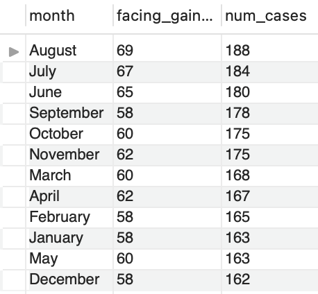<!-- -->
#### 14. Seeing if there is a correlation between account visits and # of cases sold
```
SELECT year,SUM(account_visits) as total_accounts,
       SUM(cases_sold_dollars) as total_cases_$,
       SUM(num_cases) total_cases
FROM rep
WHERE year IN('2021','2022')
GROUP BY 1;
```
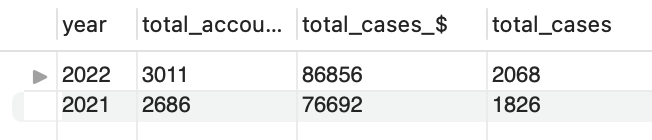<!-- -->

###### *Now the data is ready to be visualized in Tableau*

## [Link to Tableau Dashboard](https://public.tableau.com/views/Sales_Rep_Dashboard/Dashboard1?:language=en-US&:display_count=n&:origin=viz_share_link)

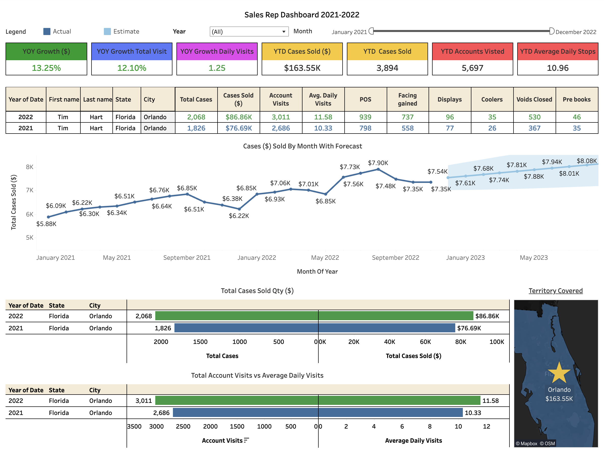<!-- -->

## Final insights
1. There is a direct correlation between account visits and cases sold.
2. I have performed better in every metric compared to last year
3. There is a direct correlation between facing gained, POS, coolers placed and # of cases sold. 
4. August was my best month of sales
5. June, July, August are the busiest months while the winter/holidays months are the slowest
6. December was my worst perfroming month because I took a vacation.
7. There was a 12.1% YOY increase in account visits which correalted to a 13.25% increase in cases sold.
8. According to the forecast model in Tableau I am projected to hit $8k in monthly sales compared to $7.5k
9. I sold $10 k more than last year and increased my daily visits by more than one stop a day!
10. I sold a total of $86.86k compared to $76.69k pervious year and visited a 3011 accounts compared to 2686 last year
